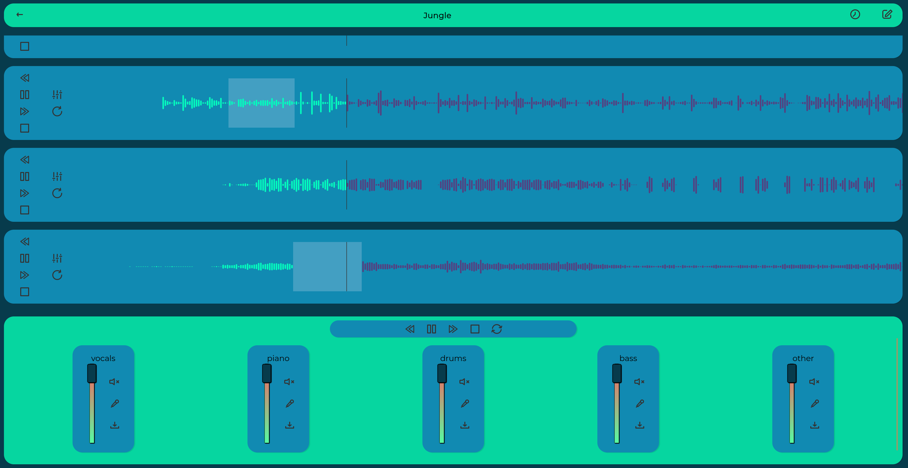

> Related Backend API Project - [Signal Separation](https://github.com/vitrioil/signal_separation)

# Working
Music Recombiner uploads the music file to the signal separation API. This separates music signal into different stems depending on the configuration chosen. (e.g. stem=5 will have: vocals, piano, drum, bass and other)

The resulting stem signal can be augmented and recombined. Example scenario: Reduce only drum volume in a particular part of a song.

Upload song and separate into 5 stems.

Select a part of song of a stem and apply specific augmentations.

Listen to the augmented song!
